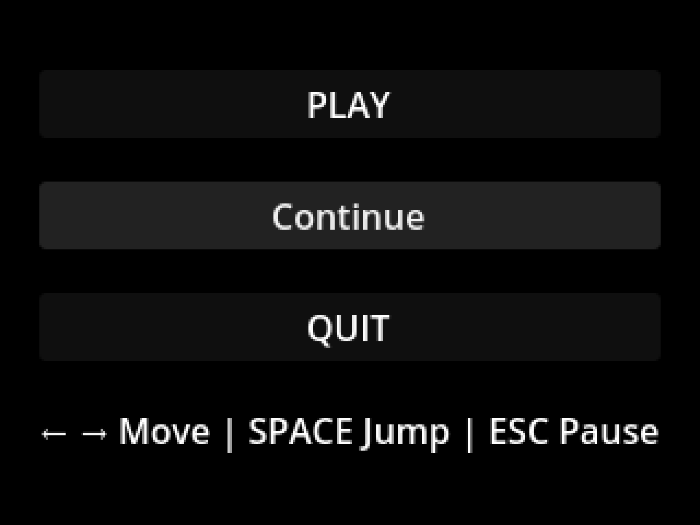

# p1proto



A compact 2D platformer prototype built with **Godot 4** and a **Rust GDExtension**. Room-to-room traversal, stateful world objects, lightweight save data, and gameplay logic on the Rust side.

## Highlights

- Player movement with coyote time, jump buffering, jump cut, and ground turn acceleration.
- Multi-room traversal via boundary transitions and portal teleports.
- LDtk-authored rooms imported as Godot scenes.
- Stateful entities: checkpoints, collectible stars, keys/locks, pressure plates, moving/crumbling platforms, pushable crates, portals, switch doors.
- Menu flow (New Game / Continue), pause menu, star counter, and explored-room world map.

## Quick Start

Requires **Rust** (`cargo`) and **Godot 4** on `PATH`.

```bash
cd rust && cargo build
cd ../godot && godot --path .
```

Or on Windows:

```powershell
./scripts/run.ps1                  # build + launch
./scripts/run.ps1 -Build Release   # release build
./scripts/run.ps1 -Editor          # open editor
./scripts/export.ps1               # export Windows build
```

## Controls

| Key | Action |
|-----|--------|
| Left / Right | Move |
| Space | Jump |
| Up | Activate portals |
| M | Toggle world map |
| Esc | Pause |
| B | Toggle background music |

## Repository Layout

| Directory | Contents |
|-----------|----------|
| [`godot/`](godot/) | Godot project, scenes, assets, pipelines, and add-ons |
| [`rust/`](rust/) | GDExtension crate — gameplay, UI, rooms, save logic |
| [`scripts/`](scripts/) | Helper scripts (run, export, update gdext) |
| [`screenshots/`](screenshots/) | Media for docs and store listings |
| [`docs/`](docs/) | Supporting documentation |

## License

[MIT](LICENSE) — bundled add-on licenses under [`godot/addons/`](godot/addons/) may differ.
